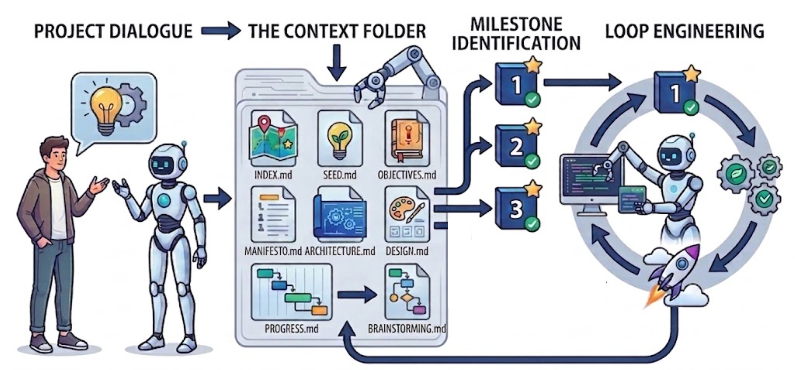

# Kia Context

**A Loop Engineering-friendly Kit of Markdown Files to Maintain Project Context for/by Agents. Nothing More!**

Not a framework. Not a workflow. Not a competitor to [spec-kit](https://github.com/github/spec-kit),
Claude's memory, or your agent's own features. Use all of those. What I provide are the
context docs you end up asking an agent to write anyway — same names, same places, so it knows where
things go without being told every session.

There is nothing to learn. You talk to your agent normally; it keeps the files up to date.

## Quick Install

```bash
curl -sSL https://raw.githubusercontent.com/amirkiarafiei/kia-context/main/install.sh | bash
```


## How to Use



Sorry I just lied. There is one small thing you need to learn:

1. **Talk to your Agent**: Brainstorm features, design architecture, and make key decisions as usual.
2. **Define milestones:** Establish your implementation plan. The agent records each milestone and its acceptance criteria in `PROGRESS.md`.
3. **Loop over the milestones:** Work through them sequentially or in batches, whichever suits your workflow — one at a time, several at once.

The agent updates the necessary files the way it writes commit messages.

## Context System

Eight files under `context/`. The agent reads and writes all of them.


| File                    | What it holds                                                                                                                                                       |
| ----------------------- | ------------------------------------------------------------------------------------------------------------------------------------------------------------------- |
| `INDEX.md`              | The map. What every other file is, which era it covers, and which one to open for a given question. Read first.                                                     |
| `genesis/SEED.md`       | The first prompts that started the project, lightly cleaned. Written once, then left alone.                                                                         |
| `genesis/GENESIS.md`    | Why the project exists — what happened that made it start, who it is for, and what was deliberately left out on day one.                                            |
| `specs/MANIFESTO.md`    | What the product is, and the numbered rules it may not break. Plain English, no jargon; this is the one people read.                                                |
| `specs/ARCHITECTURE.md` | How it actually works — the things it deals with, the states they move through, the rules it enforces, and the stack underneath.                                    |
| `specs/DESIGN.md`       | The design system in [DESIGN.md](https://github.com/google-labs-code/design.md) format — tokens plus the reasoning behind them. Delete it if there is no interface. |
| `logs/PROGRESS.md`      | Milestones, their deliverables and acceptance criteria, and a short report when each one closes. Where the agent looks to find the next thing to build.             |
| `logs/BRAINSTORM.md`    | Numbered decisions and open questions. Why an option was chosen and what was rejected — so nobody re-argues it in three months.                                     |


Beside them, `docs/` holds human-facing write-ups — software and system architecture, deployment,
authentication, security. Those are written **only when someone asks for one**, may hold diagrams and long
text, and are free to go out of date, because nothing reads them to do the work.

Delete whatever your project does not need. Every layout in every file is a suggestion; only the
frontmatter is fixed.

## Skills

You can run them, and so can the agent.


|                     | When                                                                                                                                                                                                                                                                                                 |
| ------------------- | ---------------------------------------------------------------------------------------------------------------------------------------------------------------------------------------------------------------------------------------------------------------------------------------------------- |
| `/kia-context-init` | Once per repo, straight after installing. Works on a half-built project too: it reads your code for `ARCHITECTURE.md` and `DESIGN.md`, drafts `PROGRESS.md` and `BRAINSTORM.md` from git history and flags them as inferred, and asks you a few short questions for `GENESIS.md` and `MANIFESTO.md`. |
| `/kia-context-help` | Any time you or the agent are unsure what a file is for, or where something should be written down.                                                                                                                                                                                                  |
| `/kia-context-sync` | After a stretch of work, before a handover, or whenever the files have fallen behind what the code actually does.                                                                                                                                                                                    |


## Loop-engineering-friendly

A finished milestone list with acceptance criteria is what an autonomous loop needs: a next task, a
definition of done, and a place to write the result. `PROGRESS.md` ships with its own loop protocol and
circuit breakers, so the loop knows when to stop.

That comes from the format. Nothing here needs a loop.

## Installation

The one-liner at the top is the fast path. To read the script before running it, clone the repo and run
`./install.sh`. Either way it asks one question — which agents work in this repo — never overwrites a
file you already have, and is safe to run again.

```
./install.sh                                    interactive
./install.sh --yes --agents claude,cursor       non-interactive
./install.sh --dry-run                          show what it would do
```

It does three things: creates `context/` and `docs/`, adds the agent instructions to `AGENTS.md` (and
`CLAUDE.md` / `GEMINI.md`) inside markers so a re-run replaces them instead of adding a second copy, and
installs three project-scoped skills for the agents you pick.

## Naming Philosophy

**Kia** as in Amirkia. Also as in the car.

Kia builds cars that are genuinely good without being the best or the most expensive. Nobody buys one
expecting a Ferrari, and nobody regrets it either. It starts every morning, it does the job, and everyone
is happy with it. It has never pretended to be a Rolls-Royce.

Same here. This is not competing with [spec-kit](https://github.com/github/spec-kit) or
[Superpowers](https://github.com/obra/superpowers). Those are doing something more ambitious. Kia Context is just a good way to maitain project context. Simple, easy to understand, and enough.

Nothing more.

## Layout of this repository

```
install.sh          the installer
_template/          the markdown files it copies, plus AGENTS.harness.md
skills/             the three skills
```

MIT.