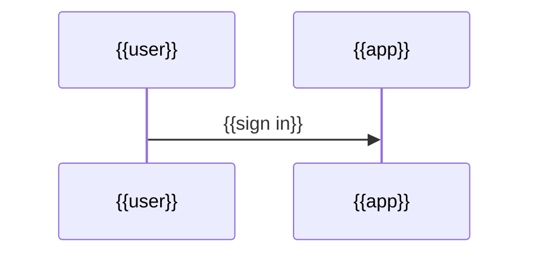

# Authentication — {{Project}}

> **The layout below is a sample, not a requirement.** Keep it, drop it, reorder it, or replace it
> entirely with whatever this project actually needs — you are not filling in a form, and an empty
> section is worse than a missing one. The one thing that must **not** change is the frontmatter above:
> those six fields are what make this file part of kiacontext.

**Contents** · [Who can sign in](#who-can-sign-in) · [How identity is established](#how-identity-is-established) · [Sessions](#sessions) · [Where credentials live](#where-credentials-live) · [Adding and removing an account](#adding-and-removing-an-account)

> Not written yet. Delete this file if this project has no sign-in.

## Who can sign in

| Role | Can see | Can change |
|---|---|---|

## How identity is established

## Sessions

## Where credentials live

> The mechanism and the location. **Never a value.**

## Adding and removing an account
