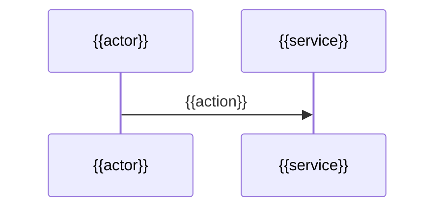

# System Architecture — {{Project}}

> **The layout below is a sample, not a requirement.** Keep it, drop it, reorder it, or replace it
> entirely with whatever this project actually needs — you are not filling in a form, and an empty
> section is worse than a missing one. The one thing that must **not** change is the frontmatter above:
> those six fields are what make this file part of kiacontext.

**Contents** · [The topology](#the-topology) · [What each piece does](#what-each-piece-does) · [A request, end to end](#a-request-end-to-end) · [Failure modes, and what happens](#failure-modes-and-what-happens) · [Scale and limits](#scale-and-limits)

> Not written yet. Delete this file if this project does not need one.

## The topology

```mermaid
graph TD
  U[{{client}}] --> S[{{service}}]
  S --> D[({{store}})]
```

## What each piece does

## A request, end to end



## Failure modes, and what happens

## Scale and limits
